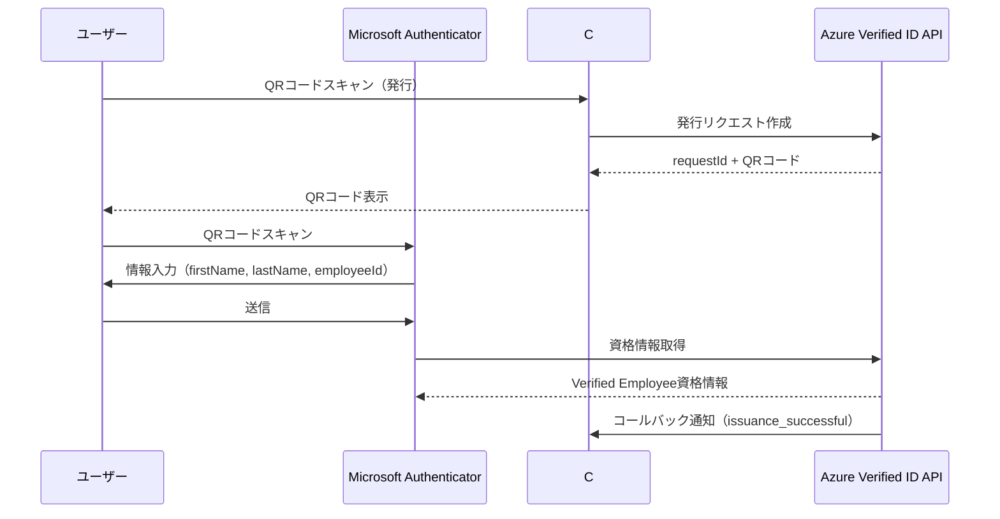
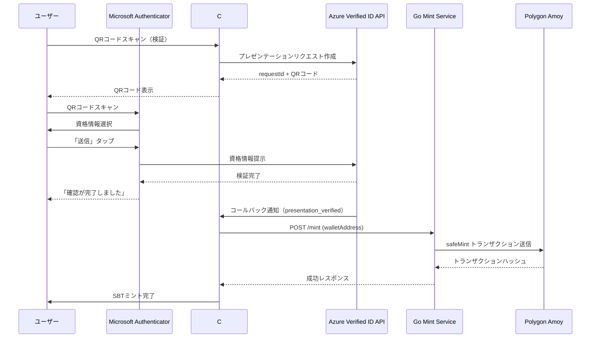

# Microsoft Entra Verified ID + Soulbound Token 統合システム

## 📋 プロジェクト概要

本プロジェクトは、Microsoft Entra Verified ID（検証可能な資格情報）とブロックチェーン上のSoulbound Token（譲渡不可能なNFT）を統合したPoCシステムです。

### 目的
- デジタルアイデンティティの検証（Verified ID）
- ブロックチェーン上での証明（SBT）
- 自動化されたエンドツーエンドフロー

### 主な機能
1. **資格情報の発行**: Azure Verified IDで検証可能な資格情報を発行
2. **資格情報の検証**: Microsoft Authenticatorアプリで資格情報を提示
3. **SBTの自動ミント**: 検証成功後、Polygon AmoyネットワークでSBTを自動発行

---

## 🏗️ システムアーキテクチャ

```
┌─────────────────────────────────────────────────────────────────┐
│                         ユーザー                                 │
│                    (Microsoft Authenticator)                     │
└──────────────────┬──────────────────────────────────────────────┘
                   │
                   │ ① QRコードスキャン（発行）
                   ↓
┌─────────────────────────────────────────────────────────────────┐
│              Azure Entra Verified ID API                         │
│          https://verifiedid.did.msidentity.com                   │
└──────────────────┬──────────────────────────────────────────────┘
                   │
                   │ ② 資格情報発行
                   ↓
┌─────────────────────────────────────────────────────────────────┐
│                    Microsoft Authenticator                       │
│              (Verified Employee資格情報を保存)                   │
└──────────────────┬──────────────────────────────────────────────┘
                   │
                   │ ③ QRコードスキャン（検証）
                   ↓
┌─────────────────────────────────────────────────────────────────┐
│              C# バックエンドサービス                              │
│              (ASP.NET Core Minimal API)                          │
│              Port: 5062                                          │
│              Public: https://xxx.ngrok-free.dev                  │
├─────────────────────────────────────────────────────────────────┤
│  - /api/issue: 資格情報発行リクエスト                             │
│  - /api/verify: 資格情報検証リクエスト                            │
│  - /api/issuance-callback: 発行コールバック                       │
│  - /api/presentation-callback: 検証コールバック                   │
└──────────────────┬──────────────────────────────────────────────┘
                   │
                   │ ④ コールバック受信 → SBTミントリクエスト
                   ↓
┌─────────────────────────────────────────────────────────────────┐
│                  Go Mint Service                                 │
│                  Port: 8080                                      │
├─────────────────────────────────────────────────────────────────┤
│  - /mint: SBTミントエンドポイント                                 │
│  - /health: ヘルスチェック                                        │
└──────────────────┬──────────────────────────────────────────────┘
                   │
                   │ ⑤ トランザクション送信
                   ↓
┌─────────────────────────────────────────────────────────────────┐
│              Polygon Amoy Testnet                                │
│              RPC: https://rpc-amoy.polygon.technology            │
│              Chain ID: 80002                                     │
├─────────────────────────────────────────────────────────────────┤
│  Contract: 0xFF49Af5D03DA6E855F97cE19384AE13086A32e0c           │
│  (IdentitySBT - ERC721非譲渡可能)                                │
└─────────────────────────────────────────────────────────────────┘
```

---

## 🛠️ 技術スタック

### フロントエンド
- **技術**: HTML5 / CSS3 / Vanilla JavaScript
- **特徴**: フレームワーク不要、軽量、レスポンシブ
- **ホスティング**: ローカル / GitHub Pages（無料）

### バックエンド（C#）
- **フレームワーク**: ASP.NET Core 10.0 (Minimal API)
- **認証**: Microsoft.Identity.Client (MSAL)
- **HTTP通信**: System.Net.Http.Json
- **設定管理**: Microsoft.Extensions.Configuration

### Mint Service（Go）
- **言語**: Go 1.21+
- **Ethereumライブラリ**: go-ethereum
- **スマートコントラクト**: abigen生成バインディング

### ブロックチェーン
- **ネットワーク**: Polygon Amoy Testnet
- **スマートコントラクト**: Solidity (ERC721ベース)
- **特徴**: Soulbound（譲渡不可能）

### インフラ
- **トンネリング**: ngrok
- **DIDホスティング**: GitHub Pages
- **クラウド**: Azure (Entra ID)

---

## 📝 セットアップ手順

### 前提条件
- Azure サブスクリプション
- .NET 8.0 SDK
- Go 1.21+
- ngrok アカウント
- Polygon Amoyテストネットウォレット

### 0. 環境変数のセットアップ（.env）

#### 0.1 .envファイルの作成
プロジェクトルートディレクトリに`.env`ファイルを作成します。

```bash
# .env.exampleをコピーして.envを作成
cp .env.example .env
```

#### 0.2 .envファイルの編集
以下の環境変数を設定します：

```bash
# Azure AD設定
AZURE_TENANT_ID=your-tenant-id
AZURE_CLIENT_ID=your-client-id
AZURE_CLIENT_SECRET=your-client-secret

# Verified ID設定
VERIFIED_ID_AUTHORITY=did:web:your-domain
VERIFIED_ID_CREDENTIAL_TYPE=VerifiedEmployeeV2
VERIFIED_ID_MANIFEST_URL=your-manifest-url

# ブロックチェーン設定
BLOCKCHAIN_CONTRACT_ADDRESS=0xYourContractAddress
BLOCKCHAIN_OWNER_WALLET=0xYourWalletAddress
BLOCKCHAIN_RPC_URL=https://rpc-amoy.polygon.technology
BLOCKCHAIN_CHAIN_ID=80002

# Goサービス用秘密鍵（0xプレフィックスなし）
PRIVATE_KEY=your-private-key-without-0x-prefix

# ngrok設定（ngrok起動後に更新）
PUBLIC_BASE_URL=https://your-ngrok-url.ngrok-free.dev
```

**⚠️ 重要**: `.env`ファイルは機密情報を含むため、Gitにコミットしないでください。`.gitignore`に追加されています。

### 1. Azure Verified ID環境のセットアップ

#### 1.1 Azure Portalでの設定
```bash
1. Azure Portal → Microsoft Entra ID → Verified ID
2. DIDの作成:
   - Method: Web (did:web)
   - Domain: johnyamanaka.github.io
3. ドメイン検証完了
```

#### 1.2 GitHub Pagesでの.well-known公開
```
Repository: johnyamanaka/johnyamanaka.github.io
Files:
  - .well-known/did.json
  - .well-known/did-configuration.json
  - .well-known/logo.png
```

#### 1.3 資格情報の作成
```
名前: VerifiedEmployeeV2
タイプ: Custom Credential
認証方式: selfIssued (セルフアサート)
クレーム:
  - firstName (String)
  - lastName (String)
  - employeeId (String)
```

### 2. C# バックエンドのセットアップ

#### 2.1 パッケージのインストール
```bash
cd VerifiedIDBackend
dotnet restore
```

バックエンドは起動時に親ディレクトリの`.env`ファイルを自動的に読み込みます。
`appsettings.json`はデフォルト値とテンプレートとして使用され、`.env`の値で上書きされます。

#### 2.2 起動
```bash
dotnet run
```

サービスはポート5062で起動します。

### 3. Go Mint Serviceのセットアップ

#### 3.1 依存関係のインストール
```bash
cd SBTMintService
go mod download
```

Goサービスは起動時に親ディレクトリの`.env`ファイルを自動的に読み込みます。

#### 3.2 起動
```bash
go run main.go
```

または、ビルドして実行:
```bash
go build -o sbtmint.exe
.\sbtmint.exe
```

サービスはポート8080で起動します。

### 4. Webフロントエンドの起動（オプション）

#### 4.1 ブラウザで直接開く
```bash
cd WebFrontend
start index.html
```

#### 4.2 簡易Webサーバーで起動（推奨）
```bash
# Pythonを使用
cd WebFrontend
python -m http.server 8000

# その後ブラウザで http://localhost:8000 を開く
```

**Webフロントエンドの機能**:
- QRコードの自動生成・表示
- サービス状態のリアルタイム監視
- 操作履歴の表示
- モダンでレスポンシブなUI

詳細は `WebFrontend/README.md` を参照してください。

### 5. ngrokのセットアップ

#### 4.1 ngrokのダウンロードとインストール
```bash
# https://ngrok.com/download からダウンロード
# ZIPを展開してngrok.exeを取得
```

#### 4.2 ngrokの起動
```bash
cd Downloads
.\ngrok.exe http 5062
```

#### 4.3 公開URLの取得と設定
```
表示されたForwarding URLをコピー:
例: https://xxxx-xxxx-xxxx.ngrok-free.app

.envファイルの"PUBLIC_BASE_URL"を更新
バックエンドサービスを再起動
```

---

## 🔄 エンドツーエンドフロー

### 発行フロー



### 検証＋SBTミントフロー



---

## 🔑 主要なコード

### C# - 発行リクエスト生成

```csharp
public async Task<IssuanceResponse> CreateIssuanceRequestAsync(
    string firstName,
    string lastName,
    string email,
    string callbackUrl)
{
    var accessToken = await GetAccessTokenAsync();

    var requestPayload = new
    {
        includeQRCode = true,
        authority = _verifiedIdOptions.Authority,
        registration = new { clientName = "VerifiedID SBT PoC" },
        callback = new
        {
            url = callbackUrl,
            state = email,
            headers = new Dictionary<string, string>
            {
                { "api-key", "poc-issuance-key" }
            }
        },
        type = _verifiedIdOptions.CredentialType,
        manifest = _verifiedIdOptions.ManifestUrl,
        claims = new
        {
            firstName = firstName,
            lastName = lastName,
            employeeId = email
        }
    };

    var response = await _httpClient.PostAsJsonAsync(
        _verifiedIdOptions.ApiEndpoint,
        requestPayload
    );

    return await response.Content.ReadFromJsonAsync<IssuanceResponse>();
}
```

### C# - 検証コールバック処理

```csharp
app.MapPost("/api/presentation-callback", async (
    CallbackPayload payload,
    IConfiguration configuration,
    HttpContext httpContext) =>
{
    if (payload.RequestStatus == "presentation_verified")
    {
        var walletAddress = payload.State;
        var mintServiceUrl = "http://localhost:8080/mint";

        var mintRequest = new { walletAddress = walletAddress };
        var response = await httpClient.PostAsJsonAsync(
            mintServiceUrl,
            mintRequest
        );

        if (response.IsSuccessStatusCode)
        {
            var result = await response.Content.ReadFromJsonAsync<MintResponse>();
            logger.LogInformation(
                "SBT minted successfully. TxHash: {TxHash}",
                result.TxHash
            );
        }
    }

    return Results.Ok();
});
```

### Go - SBTミント

```go
func mintSBT(walletAddress string) (string, error) {
    client, err := ethclient.Dial(rpcURL)
    if err != nil {
        return "", err
    }

    privateKeyECDSA, err := crypto.HexToECDSA(privateKey)
    if err != nil {
        return "", err
    }

    auth, err := bind.NewKeyedTransactorWithChainID(
        privateKeyECDSA,
        chainID
    )
    if err != nil {
        return "", err
    }

    // Gas設定
    gasPrice, err := client.SuggestGasPrice(context.Background())
    auth.GasLimit = uint64(300000)
    auth.GasPrice = gasPrice

    // コントラクトインスタンス作成
    contractAddr := common.HexToAddress(contractAddress)
    instance, err := NewIdentitySBT(contractAddr, client)
    if err != nil {
        return "", err
    }

    // SBTミント
    recipientAddress := common.HexToAddress(walletAddress)
    tx, err := instance.SafeMint(auth, recipientAddress)
    if err != nil {
        return "", err
    }

    return tx.Hash().Hex(), nil
}
```

---

## 🔧 トラブルシューティング

### 問題1: ゲストアカウントエラー
**エラー**: "Access tokens for guest user accounts are not allowed"

**解決策**:
- 資格情報の認証方式を`idTokenHints`から`selfIssued`に変更
- Azure Portalで新しい資格情報を作成
- ルール定義で`attestations.selfIssued`を使用

### 問題2: QRコードスキャン後に404エラー
**原因**:
- QRコードの有効期限切れ（約10分）
- ngrokが起動していない

**解決策**:
- 新しいQRコードを生成
- ngrokが正常に起動していることを確認
- `appsettings.json`の`PublicBaseUrl`を確認

### 問題3: SBTがミントされない
**原因**:
- Goサービスが起動していない
- `.env`ファイルにPRIVATE_KEYが設定されていない
- ガス不足

**解決策**:
```bash
# .envファイルを確認
# PRIVATE_KEY=your-private-key-without-0x-prefix が設定されていることを確認

# Goサービスを再起動
cd SBTMintService
go run main.go
```

### 問題4: ngrokコマンドが見つからない
**解決策**:
```bash
# ダウンロード場所に移動して直接実行
cd C:\Users\yupea\Downloads
.\ngrok.exe http 5062
```

---

## 📊 ファイル構成

```
NFTPoC/
├── .env                         # 環境変数（機密情報）※Gitに含まれない
├── .env.example                 # 環境変数テンプレート
├── .gitignore                   # Git除外設定
│
├── WebFrontend/                 # Webフロントエンド
│   ├── index.html               # メインページ
│   ├── styles.css               # スタイルシート
│   ├── script.js                # JavaScript機能
│   └── README.md                # フロントエンド説明書
│
├── VerifiedIDBackend/           # C# バックエンド
│   ├── Program.cs               # エントリーポイント、APIエンドポイント定義
│   ├── appsettings.json         # 設定ファイル（テンプレート）
│   ├── Models/
│   │   ├── IssuanceModels.cs   # 発行リクエスト/レスポンスモデル
│   │   ├── PresentationModels.cs # 検証リクエスト/レスポンスモデル
│   │   ├── CallbackModels.cs   # コールバックペイロードモデル
│   │   └── VerifiedIdOptions.cs # 設定オプション
│   └── Services/
│       └── VerifiedIdService.cs # Verified ID API通信サービス
│
├── SBTMintService/              # Go Mint Service
│   ├── main.go                  # メインロジック（.env読み込み機能付き）
│   ├── IdentitySBT.go          # スマートコントラクトバインディング
│   ├── IdentitySBT.abi         # コントラクトABI
│   ├── go.mod                   # Go依存関係
│   ├── go.sum                   # Go依存関係チェックサム
│   └── sbtmint.exe             # 実行ファイル（ビルド後）
│
├── johnyamanaka.github.io/      # DIDホスティング
│   └── .well-known/
│       ├── did.json             # DID Document
│       ├── did-configuration.json # ドメイン検証
│       └── logo.png             # 資格情報ロゴ
│
├── issuance-latest.png          # 発行用QRコード（最新）※Gitに含まれない
├── verification-latest.png      # 検証用QRコード（最新）※Gitに含まれない
└── README.md                    # このファイル
```

---

## 🎯 動作確認済み環境

- **OS**: Windows 11
- **.NET SDK**: 8.0
- **Go**: 1.21+
- **Node.js**: (ngrokのため)
- **ブラウザ**: Chrome, Edge
- **モバイルアプリ**: Microsoft Authenticator (iOS/Android)

---

## 📈 今後の展開

### 短期（1-2ヶ月）
1. **エラーハンドリングの強化**
   - リトライ機能の実装
   - 詳細なログ出力
   - エラー通知機能

2. **セキュリティ強化**
   - Azure Key Vaultでのシークレット管理
   - API認証の強化
   - レート制限の実装

3. **UI/UX改善**
   - Webフロントエンドの作成
   - リアルタイムステータス表示
   - QRコードの自動更新

### 中期（3-6ヶ月）
1. **本番環境への移行**
   - Azure App Serviceへのデプロイ
   - Polygon Mainnetへの移行
   - CDNの導入

2. **機能拡張**
   - 複数の資格情報タイプに対応
   - SBTメタデータのカスタマイズ
   - IPFS統合

3. **スケーラビリティ**
   - データベース統合（履歴管理）
   - キューシステムの導入
   - 負荷分散

### 長期（6ヶ月以上）
1. **エコシステム拡大**
   - 複数の発行者対応
   - 資格情報マーケットプレイス
   - 他のブロックチェーンへの展開

2. **ビジネスモデル**
   - エンタープライズ向けSaaS化
   - API課金システム
   - パートナーシッププログラム

---

## 🙏 謝辞

このプロジェクトは以下の技術を使用しています：

- **Microsoft Entra Verified ID**: デジタルアイデンティティの検証
- **Polygon**: スケーラブルなブロックチェーンプラットフォーム
- **ngrok**: セキュアなトンネリングサービス
- **GitHub Pages**: 静的サイトホスティング

---

## 📄 ライセンス

このプロジェクトはPoCとして作成されました。

---

## 📞 お問い合わせ

プロジェクトに関する質問や提案がありましたら、お気軽にお問い合わせください。

**作成日**: 2025年12月10日
**最終更新**: 2025年12月12日
**ステータス**: ✅ PoC完成 + GitHub対応完了
